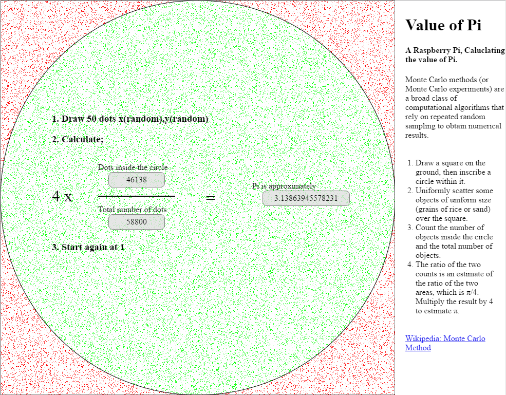

# montecarlopi

Playing with JavaScript and the canvas element. Implementation of a visualization
for the monte carlo pi approximation method.

Try it on [http://hacst.net/montecarlopi/](http://hacst.net/montecarlopi/) 
or put the contents of this repository in a folder hosted by a webserver.
